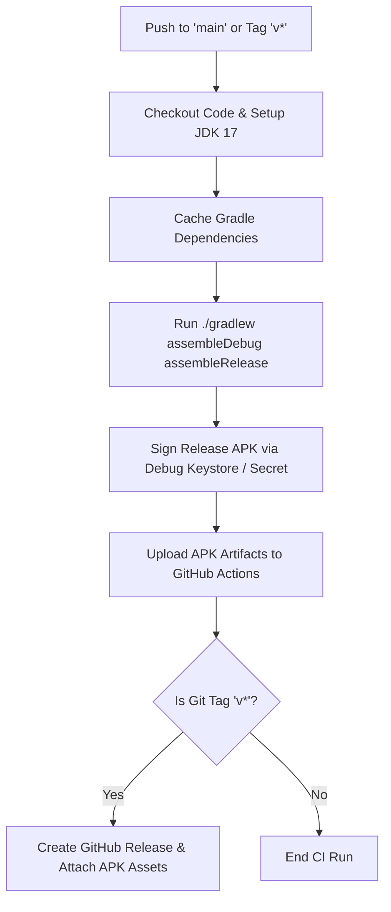

# 🚀 Build, Release & CI/CD Pipeline

> **Repository:** `zevbuild/app-zevsafe`  
> **Workflow File:** `.github/workflows/build-apk.yml`

---

## 1. Toolchain & Environment Specifications

| Component | Version / Specification |
|---|---|
| **Android Gradle Plugin (AGP)** | `8.2.2` |
| **Gradle Wrapper** | `8.2` |
| **Kotlin Version** | `1.9.22` |
| **Compose Compiler Plugin** | Kotlin Compose Compiler Extension |
| **Java Development Kit (JDK)** | OpenJDK 17 (Temurin / Zulu) |
| **Compile SDK** | `35` (Android 15) |
| **Target SDK** | `35` (Android 15) |
| **Minimum SDK** | `26` (Android 8.0 Oreo) |

---

## 2. Local Build Commands

Run the following commands using the Gradle wrapper from the root of the repository:

### Run Unit Tests
```bash
./gradlew test
```
*Executes `CryptoUnitTest.kt` and validates PBKDF2 derivation, header packing, AAD computation, chunk encryption/decryption, and tamper detection.*

### Assemble Debug APK
```bash
./gradlew assembleDebug
```
*Generates un-obfuscated debug build at `app/build/outputs/apk/debug/app-debug.apk`.*

### Assemble Release APK
```bash
./gradlew assembleRelease
```
*Generates optimized release build at `app/build/outputs/apk/release/app-release-unsigned.apk` (or signed if signing keys are present).*

---

## 3. Automated GitHub Actions CI/CD Pipeline

The `.github/workflows/build-apk.yml` workflow manages building, signing, and releasing:



### Triggers
1. **Push to `main`:** Builds both APKs to verify compilation and uploads artifacts to the GitHub Actions run summary.
2. **Push to Git Tag (`v*`):** Builds both APKs, renames them to `ZevSafe-release.apk` and `ZevSafe-debug.apk`, and publishes an official public **GitHub Release**.

---

## 4. Release Deployment Protocol

When cutting a new release:

1. **Bump Version in `app/build.gradle.kts`:**
   ```kotlin
   defaultConfig {
       versionCode = 31 // increment integer
       versionName = "6.3.1" // increment semver string
   }
   ```
2. **Update Documentation & Project Memory:**
   * Update `PROJECT_MEMORY.md` and `PROJECT-MEMORY/*.md` with all architectural or version changes.
   * Add entry in `CHANGELOG.md`.
   * Update version badges in `README.md`.
   * Run local tests: `./gradlew test`.
3. **Commit & Tag:**
   ```bash
   git add app/build.gradle.kts PROJECT_MEMORY.md PROJECT-MEMORY/ CHANGELOG.md README.md
   git commit -m "chore: release v6.3.1"
   git tag v6.3.1
   git push origin main --tags
   ```
4. **Monitor GitHub Actions & Update Release Notes:**
   * Watch the workflow complete at `https://github.com/zevbuild/app-zevsafe/actions`.
   * Verify APK downloads and formatted release notes on `https://github.com/zevbuild/app-zevsafe/releases/tag/v6.3.1`.
